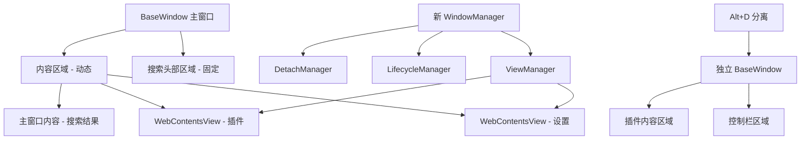

# 设计文档

## 概述

窗口管理重构将采用 Electron 原生的 BaseWindow 和 WebContentsView API 替换当前的自定义拖拽和窗口管理系统。新设计将创建一个分层架构，其中主窗口包含固定的搜索头部区域和动态的内容区域，内容区域通过 WebContentsView 实现快速切换和高效管理。

核心设计理念是**组合优于继承**，通过 WebContentsView 的组合实现多样化的窗口布局，同时保持代码的简洁性和可维护性。

## 指导文档对齐

### 技术标准 (tech.md)

本设计遵循项目的技术标准：

- **TypeScript 5.9.2**：所有新代码使用 TypeScript 实现类型安全
- **模块化多进程架构**：保持主进程和渲染进程的清晰分离
- **IPC 通信架构**：利用现有的类型安全 IPC 路由系统
- **分层架构模式**：遵循现有的服务层、IPC 层、UI 层分离原则

### 项目结构 (structure.md)

新组件将按照现有的目录结构组织：

- **主进程**：在 `src/main/config/` 下创建新的窗口管理器
- **渲染进程**：在 `src/renderer/src/core/window/` 下创建窗口管理组件
- **类型定义**：在 `src/renderer/src/typings/` 下定义相关类型
- **IPC 路由**：扩展 `src/main/ipc-router/modules/window.ts`

## 代码复用分析

### 要利用的现有组件

- **WindowManager (window-manager.ts)**：扩展现有的窗口管理器以支持 BaseWindow
- **IPC 路由系统**：利用现有的类型安全 IPC 通信机制
- **SearchHeader 组件**：保留并增强现有的搜索头部组件
- **PluginManager**：集成现有的插件管理系统
- **事件系统 (mitt)**：利用现有的事件发射器进行组件通信

### 集成点

- **现有窗口系统**：平滑迁移现有的 BrowserWindow 到 BaseWindow
- **插件 API**：保持现有插件 API 的兼容性
- **设置系统**：集成现有的设置管理和存储系统
- **快捷键系统**：集成现有的快捷键管理机制

## 架构

新的窗口管理系统采用**分层组合架构**，通过以下层次实现功能：

### 模块化设计原则

- **单文件职责**：每个文件专注于一个特定的窗口管理功能
- **组件隔离**：创建小而专注的组件而非大型单体文件
- **服务层分离**：分离数据访问、业务逻辑和表现层
- **工具模块化**：将工具函数拆分为专用的单一目的模块



## 组件和接口

### NewWindowManager

- **用途**：统一管理所有窗口和视图的生命周期
- **接口**：
  - `createMainWindow(): BaseWindow`
  - `showView(type: ViewType, path?: string): Promise<void>`
  - `hideView(type: ViewType): Promise<void>`
  - `detachView(viewId: string): Promise<BaseWindow>`
  - `cleanup(): Promise<void>`
- **依赖**：ViewManager, LifecycleManager, DetachManager
- **复用**：扩展现有的 WindowManager 类

### ViewManager

- **用途**：管理 WebContentsView 的创建、切换和布局
- **接口**：
  - `createView(type: ViewType, config: ViewConfig): WebContentsView`
  - `switchToView(viewId: string): Promise<void>`
  - `removeView(viewId: string): Promise<void>`
  - `getActiveView(): WebContentsView | null`
- **依赖**：无
- **复用**：利用现有的视图配置逻辑

### LifecycleManager

- **用途**：管理视图的生命周期策略（前台/后台）
- **接口**：
  - `setLifecycleStrategy(viewId: string, strategy: LifecycleStrategy): void`
  - `handleViewClose(viewId: string): Promise<void>`
  - `cleanupBackgroundViews(): Promise<void>`
  - `pauseView(viewId: string): Promise<void>`
  - `resumeView(viewId: string): Promise<void>`
- **依赖**：ViewManager
- **复用**：集成现有的插件生命周期逻辑

### DetachManager

- **用途**：处理视图分离到独立窗口的逻辑
- **接口**：
  - `detachView(view: WebContentsView): Promise<BaseWindow>`
  - `createDetachedWindow(config: DetachedWindowConfig): BaseWindow`
  - `handleDetachedWindowClose(windowId: number): Promise<void>`
- **依赖**：ViewManager
- **复用**：参考 `参考.js` 中的分离逻辑

### SearchHeaderManager

- **用途**：管理搜索头部区域的功能和状态
- **接口**：
  - `initialize(container: HTMLElement): void`
  - `setDraggable(enabled: boolean): void`
  - `showSearchResults(results: SearchResult[]): void`
  - `clearSearch(): void`
- **依赖**：现有的搜索系统
- **复用**：扩展现有的 SearchHeader 组件

### BaseWindowController

- **用途**：控制 BaseWindow 的创建和基本属性
- **接口**：
  - `createMainWindow(config: MainWindowConfig): BaseWindow`
  - `createDetachedWindow(config: DetachedWindowConfig): BaseWindow`
  - `setWindowBounds(window: BaseWindow, bounds: Rectangle): void`
- **依赖**：现有的窗口配置系统
- **复用**：集成现有的窗口管理逻辑

## 数据模型

### ViewConfig

```typescript
interface ViewConfig {
  id: string;
  type: ViewType; // 'settings' | 'plugin'
  path?: string; // 插件路径，用于唯一标识
  url?: string; // 要加载的 URL
  bounds: Rectangle; // 视图边界
  lifecycle: LifecycleStrategy; // 生命周期策略
  preload?: string; // 预加载脚本路径
  webSecurity?: boolean; // Web 安全设置
}
```

### LifecycleStrategy

```typescript
interface LifecycleStrategy {
  type: "foreground" | "background"; // 前台或后台策略
  persistOnClose: boolean; // 关闭时是否保持
  maxIdleTime?: number; // 最大空闲时间（毫秒）
  memoryThreshold?: number; // 内存阈值（MB）
}
```

### DetachedWindowConfig

```typescript
interface DetachedWindowConfig {
  title: string;
  bounds: Rectangle;
  sourceViewId: string;
  showControlBar: boolean;
  parentWindowId?: number;
  metadata?: PluginMetadata;
}
```

### ViewState

```typescript
interface ViewState {
  id: string;
  type: ViewType;
  isActive: boolean;
  isVisible: boolean;
  isDetached: boolean;
  lastAccessTime: number;
  memoryUsage?: number;
  lifecycle: LifecycleStrategy;
}
```

### MainWindowLayout

```typescript
interface MainWindowLayout {
  headerHeight: number; // 搜索头部高度
  contentBounds: Rectangle; // 内容区域边界
  totalBounds: Rectangle; // 整个窗口边界
  padding: number; // 内边距
}
```

## 错误处理

### 错误场景

1. **WebContentsView 创建失败**
   - **处理**：回退到 BrowserWindow 模式，记录错误日志
   - **用户影响**：显示降级模式提示，功能基本可用

2. **插件加载失败**
   - **处理**：显示错误消息，提供重试选项，清理资源
   - **用户影响**：显示"插件加载失败"消息，可以重试或跳过

3. **视图切换失败**
   - **处理**：回滚到之前的视图状态，记录错误
   - **用户影响**：保持当前视图，显示切换失败提示

4. **窗口分离失败**
   - **处理**：保持视图在主窗口中，显示错误消息
   - **用户影响**：Alt+D 操作无效，显示"分离失败"提示

5. **内存不足**
   - **处理**：自动清理后台视图，强制垃圾回收
   - **用户影响**：后台插件可能被关闭，显示内存清理提示

## 测试策略

### 单元测试

- **NewWindowManager**：测试窗口创建、切换、关闭逻辑
- **ViewManager**：测试视图创建、切换、布局计算
- **LifecycleManager**：测试生命周期策略执行
- **DetachManager**：测试视图分离和窗口创建

### 集成测试

- **窗口-视图集成**：测试 BaseWindow 与 WebContentsView 的协作
- **插件集成**：测试插件加载、显示、关闭流程
- **快捷键集成**：测试 Alt+D 分离功能
- **IPC 集成**：测试主进程与渲染进程的通信

### 端到端测试

- **用户工作流**：搜索 → 选择插件 → 使用插件 → 关闭/分离
- **多插件切换**：在多个插件间快速切换
- **设置访问**：打开设置、修改配置、保存并关闭
- **分离窗口管理**：分离插件、操作分离窗口、关闭分离窗口
