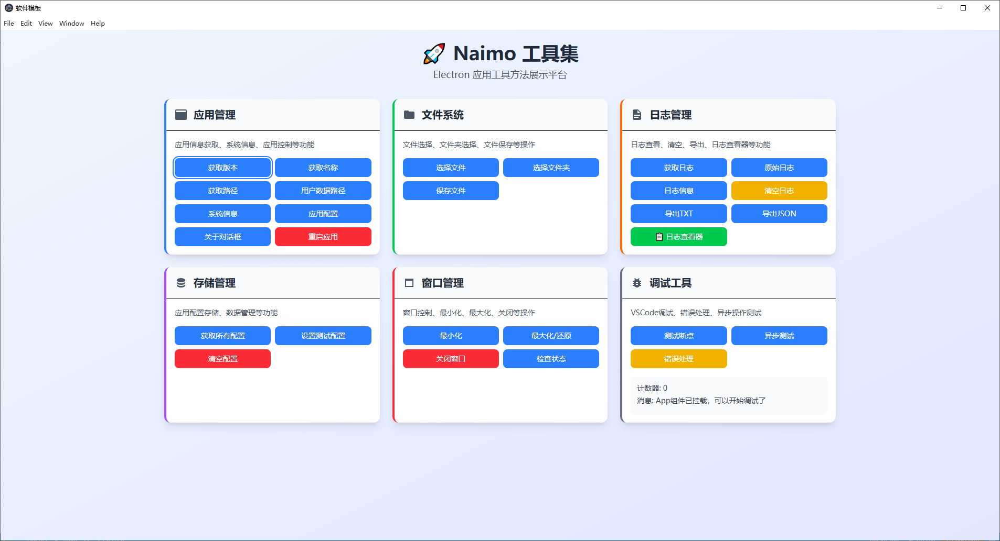
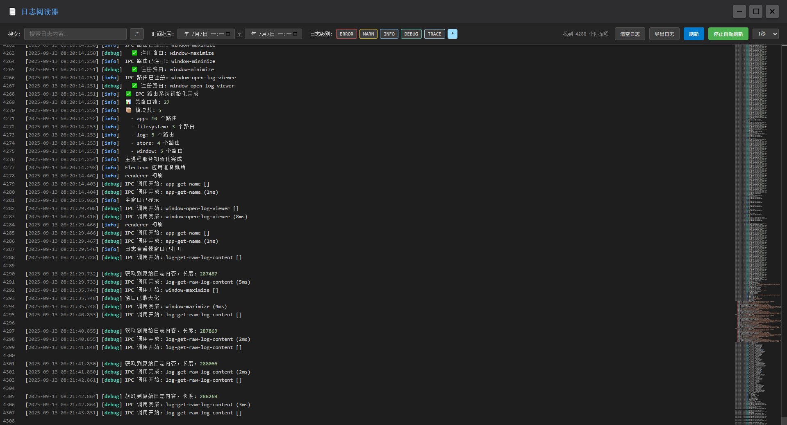

# Naimo - 现代化 Electron 应用开发模板

一个基于 Electron + Vue 3 + TypeScript 的现代化桌面应用开发模板，集成了完整的开发工具链和最佳实践。项目采用模块化架构设计，提供了类型安全的 IPC 通信、统一的日志系统、数据存储解决方案和完整的调试环境。

## ✨ 核心特性

### 🚀 现代化技术栈

- **Electron**: 跨平台桌面应用框架
- **Vue 3**: 渐进式 JavaScript 框架，支持 Composition API
- **TypeScript**: 类型安全的 JavaScript 超集
- **Vite**: 快速的前端构建工具，支持热重载

### 🔧 开发工具链

- **Electron Forge**: 应用打包和分发工具
- **ts-morph**: TypeScript 代码分析和生成工具
- **electron-log**: 统一的日志记录系统
- **electron-store**: 数据持久化存储
- **TailwindCSS**: 实用优先的 CSS 框架
- **Pinia**: Vue 3 状态管理库

### 🛡️ 类型安全 IPC 通信

- **自动化类型生成**: 基于 TypeScript 源码自动生成 IPC 类型定义
- **双重命名支持**: 同时支持驼峰式和短横线式命名
- **完整的类型推导**: 参数和返回值类型自动推导
- **智能代码提示**: VS Code 完整的智能提示支持

### 📝 统一日志系统

- **多进程支持**: 主进程、渲染进程、预加载脚本统一日志接口
- **自动错误捕获**: 全局错误处理和日志记录
- **日志轮转**: 自动管理日志文件大小
- **多种输出格式**: 支持控制台、文件等多种输出方式

### 💾 数据存储解决方案

- **类型安全存储**: 基于 TypeScript 的类型安全数据存储
- **跨进程访问**: 主进程和渲染进程都可以访问存储数据
- **配置管理**: 统一的配置管理和验证
- **数据持久化**: 自动数据持久化和恢复

### 🐛 完整调试环境

- **多进程调试**: 支持主进程、渲染进程、预加载脚本调试
- **VS Code 集成**: 完整的 VS Code 调试配置
- **断点调试**: 支持条件断点、日志断点等高级调试功能
- **性能分析**: 集成性能分析和内存泄漏检测工具

## 📁 项目结构

```
naimo/
├── docs/                    # 项目文档
│   ├── 项目概览.md
│   ├── IPC配置.md
│   ├── 前端部署文档.md
│   ├── 日志和存储.md
│   └── 调试.md
├── src/                     # 源代码
│   ├── main/                # 主进程代码
│   │   ├── config/          # 配置文件
│   │   ├── ipc-router/      # IPC 路由系统
│   │   │   ├── core.ts      # 核心路由逻辑
│   │   │   ├── index.ts     # 路由初始化
│   │   │   └── modules/     # 路由模块
│   │   │       ├── app.ts
│   │   │       ├── filesystem.ts
│   │   │       ├── log.ts
│   │   │       ├── store.ts
│   │   │       └── window.ts
│   │   ├── preloads/        # 预加载脚本
│   │   │   └── basic.ts
│   │   ├── services/        # 服务层
│   │   └── main.ts          # 主进程入口
│   ├── renderer/            # 渲染进程代码
│   │   ├── src/             # Vue 应用源码
│   │   │   ├── components/  # Vue 组件
│   │   │   ├── views/       # 页面视图
│   │   │   ├── store/       # 状态管理
│   │   │   ├── routers/     # 路由配置
│   │   │   └── App.vue      # 根组件
│   │   └── public/          # 静态资源
│   └── shared/              # 共享代码
│       ├── typings/         # 类型定义
│       │   ├── global.d.ts
│       │   └── ipc-routes.ts
│       ├── types.ts         # 共享类型
│       ├── utils.ts         # 工具函数
│       └── ipc-router-client.ts # IPC 客户端
├── scripts/                 # 构建脚本
│   ├── dev.js               # 开发环境启动
│   ├── build.js             # 生产环境构建
│   └── generate-ipc-types.js # IPC 类型生成
├── setup/                   # 安装包配置
├── dist/                    # 构建输出
└── package.json             # 项目配置
```

## 🚀 快速开始

### 环境要求

- Node.js >= 18.0.0
- pnpm >= 8.0.0
- VS Code (推荐)

### 安装依赖

```bash
# 克隆项目
git clone <repository-url>
cd naimo

# 使用 pnpm (推荐)
pnpm install

# 或使用 npm
npm install
```

### 开发模式

```bash
# 启动开发环境
pnpm dev

# 或者使用 VS Code 调试
# 按 F5 启动调试会话
```

这将同时启动：

- Vite 开发服务器 (渲染进程)
- TypeScript 编译器 (主进程)
- Electron 应用

### 调试模式

项目提供了完整的 VS Code 调试配置：

1. 在 VS Code 中按 `F5` 或点击调试面板中的 "🚀 开始调试"
2. 应用将启动并自动连接调试器
3. 可以在代码中设置断点进行调试

支持的调试配置：

- 🔧 启动开发服务器
- 🔧 Electron: 主进程
- 🔧 Electron: 渲染进程
- 🔧 Electron: Preload

### 构建应用

```bash
# 构建应用
pnpm build

# 打包应用
pnpm make

# 创建 NSIS 安装包 (Windows)
pnpm build:nsis-win64
```

### IPC 类型生成

```bash
# 生成 IPC 类型定义
pnpm generate:ipc-types
```

该命令会：

- 扫描 `src/main/ipc-router/modules/` 下的所有 TypeScript 文件
- 使用 `ts-morph` 解析函数签名、注释和类型信息
- 自动生成 `src/shared/typings/ipc-routes.ts` 类型定义文件

## 📋 可用脚本

- `pnpm dev` - 启动开发模式
- `pnpm build` - 构建应用
- `pnpm make` - 创建安装包
- `pnpm build:nsis-win64` - 创建 Windows NSIS 安装包
- `pnpm generate:ipc-types` - 生成 IPC 类型定义
- `pnpm start` - 启动已构建的应用

## 🛠️ 配置

### IPC 路由系统

项目实现了类型安全的 IPC 通信系统：

```typescript
// 定义 IPC 路由
// src/main/ipc-router/modules/app.ts
export function getVersion(): string {
  return app.getVersion();
}

// 渲染进程调用
const version = await api.ipcRouter.appGetVersion();
```

**特性**：

- 自动化类型生成
- 双重命名支持（驼峰式和短横线式）
- 完整的类型推导
- VS Code 智能提示

### 日志系统

使用 `electron-log` 实现统一日志管理：

```typescript
// 主进程
import log from "electron-log";
log.info("应用启动成功");

// 渲染进程
api.log.info("用户操作", { action: "click" });
```

**特性**：

- 多进程支持
- 自动错误捕获
- 日志轮转
- 多种输出格式

### 数据存储

使用 `electron-store` 实现数据持久化：

```typescript
// 主进程
const store = new Store();
store.set("user.name", "John Doe");

// 渲染进程
await api.ipcRouter.storeSet("user.name", "John Doe");
const userName = await api.ipcRouter.storeGet("user.name");
```

**特性**：

- 类型安全存储
- 跨进程访问
- 配置管理
- 数据持久化

### 前端配置

项目使用现代化的前端技术栈：

- **TailwindCSS**: 实用优先的 CSS 框架
- **Vue 3**: 支持 Composition API
- **Pinia**: 状态管理
- **自动导入**: API 和组件自动导入
- **图标系统**: 基于 unplugin-icons 的图标管理

## 🚢 部署和发布

### 构建配置

项目使用 Electron Forge 进行构建和打包：

```json
{
  "config": {
    "forge": {
      "packagerConfig": {
        "asar": true,
        "icon": "./setup/exe.ico"
      },
      "makers": [
        {
          "name": "@electron-forge/maker-squirrel",
          "config": {
            "name": "electron_app"
          }
        }
      ]
    }
  }
}
```

### 安装包制作

项目支持创建 Windows 安装包：

```bash
# 创建 NSIS 安装包
pnpm build:nsis-win64
```

### 自动更新

集成了 `update-electron-app` 支持自动更新：

```typescript
import { autoUpdater } from "update-electron-app";

// 配置自动更新
autoUpdater({
  repo: "your-username/your-repo",
  updateInterval: "1 hour",
});
```

## 🎯 功能演示

### 主界面



应用采用现代化的界面设计，支持深色/浅色主题切换，提供直观的用户体验。

### 日志管理



内置的日志查看器提供完整的日志管理功能，支持实时查看、过滤和导出日志文件。

### 核心功能

应用包含以下演示功能：

1. **日志测试**: 测试不同级别的日志记录
2. **存储测试**: 测试数据的存储和读取
3. **主题切换**: 深色/浅色主题切换
4. **应用信息**: 显示应用版本和配置信息
5. **数据清理**: 清空所有存储的数据
6. **日志查看器**: 内置的日志查看和管理工具

## 🔧 开发指南

### 添加新的 IPC 路由

1. 在 `src/main/ipc-router/modules/` 下创建或编辑模块文件
2. 导出带注释和类型注解的函数
3. 运行 `pnpm generate:ipc-types` 重新生成类型
4. 在渲染进程中使用 `api.ipcRouter` 调用

```typescript
// src/main/ipc-router/modules/app.ts
/**
 * 获取应用版本
 */
export function getVersion(): string {
  return app.getVersion();
}
```

### 添加新的 Vue 组件

1. 在 `src/renderer/src/components/` 下创建组件文件
2. 使用 TypeScript 和 Composition API
3. 在需要的地方导入和使用组件

```vue
<template>
  <div class="my-component">
    <IconMdiHome class="v-icon" />
  </div>
</template>

<script setup lang="ts">
// 无需导入，直接使用 Vue APIs
const count = ref(0);
</script>
```

### 配置应用设置

1. 在 `src/shared/types.ts` 中定义配置类型
2. 在 `src/main/config/` 下添加配置文件
3. 使用 `api.ipcRouter.storeSet/get` 管理配置

### 调试技巧

1. **使用 debugger 语句**: 当 VS Code 断点不生效时
2. **条件断点**: 在特定条件下触发断点
3. **日志断点**: 记录信息而不暂停执行
4. **性能调试**: 使用 Chrome DevTools 的 Performance 面板

## 🎯 最佳实践

### 代码组织

- 按功能模块组织代码
- 使用 TypeScript 严格模式
- 遵循 ESLint 规则
- 编写清晰的注释和文档

### 错误处理

- 使用 try-catch 包装可能出错的代码
- 记录详细的错误日志
- 提供用户友好的错误提示
- 实现适当的错误恢复机制

### 性能优化

- 避免频繁的 IPC 调用
- 使用缓存减少重复计算
- 优化渲染性能
- 监控内存使用情况

### 安全性

- 验证所有用户输入
- 使用 contextBridge 安全地暴露 API
- 避免在主进程中执行不可信代码
- 定期更新依赖包

## ❓ 常见问题

### Q: 如何制作应用图标？

A: 推荐使用以下步骤制作专业的应用图标：

#### 方法一：AI 生成 + 在线工具处理

1. **AI 生成图标**：

   - 使用即梦 AI 绘图或其他 AI 绘图工具
   - 提示词示例：`设计一个现代化的应用图标，简洁风格，透明背景，适合桌面应用`
   - 确保生成透明背景的 PNG 格式图片

2. **在线工具处理**：

   - 访问 [ICO 转换工具](https://www.butterpig.top/icopro/)
   - 上传生成的 PNG 图片
   - 选择多种尺寸（16x16, 32x32, 48x48, 64x64, 128x128, 256x256）
   - 下载生成的 ICO 文件

3. **替换项目图标**：
   ```bash
   # 将生成的图标文件替换项目中的图标
   cp your-icon.ico setup/exe.ico
   ```

#### 方法二：专业设计工具

1. **使用 Figma/Sketch**：

   - 创建 512x512 的画布
   - 设计简洁的图标，确保在小尺寸下仍然清晰
   - 导出为 PNG 格式（透明背景）

2. **使用 GIMP/Photoshop**：
   - 创建多尺寸的图标文件
   - 使用图层样式增强视觉效果
   - 导出为 ICO 格式

#### 图标设计建议

- **尺寸要求**：至少包含 16x16 到 256x256 的多种尺寸
- **设计原则**：简洁、识别度高、在小尺寸下清晰可见
- **颜色搭配**：考虑深色/浅色主题的兼容性
- **格式要求**：最终使用 ICO 格式，支持透明背景

#### 验证图标效果

```bash
# 构建应用查看图标效果
pnpm build
pnpm make
```

### Q: 如何添加新的依赖包？

A: 使用 pnpm 添加依赖：

```bash
# 生产依赖
pnpm add package-name

# 开发依赖
pnpm add -D package-name
```

### Q: 如何配置不同的构建环境？

A: 在 `package.json` 中配置不同的脚本，或使用环境变量。

### Q: 如何处理跨平台兼容性？

A: 使用 Electron 的跨平台 API，避免使用平台特定的代码。

### Q: 如何优化应用启动速度？

A:

1. 延迟加载非关键模块
2. 优化预加载脚本
3. 减少主进程初始化时间

### Q: Preload 脚本断点不生效怎么办？

A:

1. 使用 `debugger` 语句强制中断
2. 检查 VS Code 调试配置是否正确
3. 重启调试会话

## 📚 文档

项目包含详细的文档：

- [项目概览](docs/项目概览.md) - 项目整体介绍和技术栈
- [IPC 配置](docs/IPC配置.md) - IPC 通信系统详细说明
- [前端部署文档](docs/前端部署文档.md) - 前端技术栈和配置
- [日志和存储](docs/日志和存储.md) - 日志系统和数据存储使用指南
- [调试](docs/调试.md) - 完整的调试指南

## 📝 许可证

MIT License

## 🤝 贡献

1. Fork 项目
2. 创建功能分支
3. 提交更改
4. 推送到分支
5. 创建 Pull Request

## 📞 支持

如有问题或建议，请通过以下方式联系：

- 创建 Issue
- 发送邮件
- 提交 Pull Request
