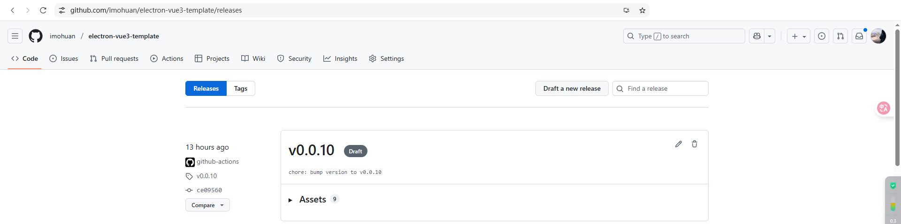

# 自动更新功能说明

## 概述

本应用集成了自动更新功能，基于 Electron 的 `autoUpdater` 模块和 `update-electron-app` 库实现。系统会自动检查并下载新版本，为用户提供无缝的更新体验。

## 更新机制

### 更新源配置

- **更新服务**: 使用 Electron 官方更新服务 (`https://update.electronjs.org`)
- **仓库地址**: `imohuan/electron-vue3-template`
- **检查频率**: 每小时自动检查一次更新
- **支持平台**: Windows (win32) 和 macOS (darwin)

### 发布流程

1. **触发条件**: 当推送以 `v` 开头的标签时（如 `v1.0.0`）
2. **构建过程**:
   - 使用 GitHub Actions 自动构建
   - 支持 Windows 和 macOS 平台
   - 通过 `pnpm run publish` 发布到 GitHub Releases
3. **发布状态**: 初始发布为草稿状态，需要手动编辑后正式发布



## 用户使用说明

### 自动更新体验

- ✅ **已安装版本**: 通过安装包安装的应用会自动检查并提示更新
- ❌ **便携版本**: ZIP 格式的便携版本不支持自动更新功能
- 🔄 **更新过程**: 检测到新版本后会自动下载，下载完成后提示用户重启应用

### 更新检查机制

- **启动检查**: 应用启动时立即检查更新
- **定期检查**: 每小时自动检查一次
- **静默下载**: 后台自动下载更新包
- **用户通知**: 下载完成后显示更新提示对话框

## 技术实现

### 代码实现位置

自动更新功能的核心实现位于以下文件中：

- **主要实现**: `src/libs/update/index.ts` - 包含完整的自动更新逻辑
- **类型定义**: `src/libs/update/typings.ts` - 定义所有相关的 TypeScript 接口和类型
- **模块配置**: `src/libs/update/package.json` - 更新模块的依赖配置
- **服务集成**: `src/main/services/app.service.ts` - 在主进程中初始化自动更新服务

### 核心配置

```typescript
updateElectronApp({
  updateSource: {
    type: UpdateSourceType.ElectronPublicUpdateService,
    repo: "imohuan/electron-vue3-template",
  },
  notifyUser: true,
  updateInterval: "1 hour",
  logger: log,
});
```

### 主要功能模块

#### 1. 更新器初始化 (`updateElectronApp`)

- 验证配置参数
- 检查开发模式（开发模式下跳过更新）
- 初始化更新器并设置事件监听

#### 2. 更新源配置

- 支持 Electron 官方更新服务
- 支持自定义静态存储服务
- 自动构建更新 URL

#### 3. 事件监听系统

- `checking-for-update`: 检查更新中
- `update-available`: 发现可用更新
- `update-not-available`: 当前已是最新版本
- `update-downloaded`: 更新下载完成
- `error`: 更新错误处理

#### 4. 用户通知机制

- 默认对话框通知
- 支持自定义通知回调
- 用户选择立即重启或稍后重启

### 更新 URL 格式

```
https://update.electronjs.org/imohuan/electron-vue3-template/win32-x64/0.0.13
```

### 依赖库

- `update-electron-app`: 自动更新核心库
- `electron-log`: 日志记录
- `ms`: 时间间隔解析
- `github-url-to-object`: GitHub 仓库信息解析

## 注意事项

### 开发者注意事项

1. **版本标签**: 确保使用正确的版本标签格式（如 `v1.0.0`）
2. **发布流程**: 发布后需要手动编辑 GitHub Release 将其从草稿状态转为正式发布
3. **平台支持**: 当前主要支持 Windows 平台，macOS 支持需要额外的代码签名配置

### 用户注意事项

1. **安装方式**: 只有通过安装包安装的应用才支持自动更新
2. **网络要求**: 需要稳定的网络连接来检查和下载更新
3. **权限要求**: 更新过程可能需要管理员权限（Windows）

## 故障排除

### 常见问题

**Q: 为什么我的应用没有自动更新？**
A: 请确认：

- 应用是通过安装包安装的，不是便携版
- 网络连接正常
- 应用版本不是开发版本

**Q: 更新下载失败怎么办？**
A: 可以尝试：

- 检查网络连接
- 重启应用重新检查更新
- 手动从 GitHub Releases 下载最新版本

**Q: 如何禁用自动更新？**
A: 目前版本不支持用户禁用自动更新，如需此功能请联系开发者

### 日志信息

应用会在日志中记录更新相关的信息：

- 更新检查状态
- 下载进度
- 错误信息

可以通过应用的日志查看功能来诊断更新问题。
