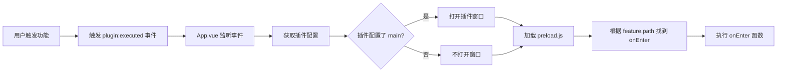

# 插件系统重构说明 - 懒加载架构

## 📋 重构背景

### 当前问题

1. **主进程加载臃肿**：插件在加载时会执行所有 `config.js` 代码，导致主窗口臃肿
2. **性能问题**：插件过多时会加载大量 JS 代码，影响启动性能
3. **稳定性风险**：加载的代码可能导致主进程崩溃

### 解决方案

**懒加载架构**：插件加载时只读取 `manifest.json` 配置，执行时才加载对应的 `preload.js` 代码

---

## 🎯 核心改动

### 1. 配置文件结构变化

#### 原架构

```
插件目录/
├── manifest.json   # 基础配置
├── config.js       # 功能配置 + onEnter/onInstall 函数
└── preload.js      # preload 脚本
```

#### 新架构

```
插件目录/
├── manifest.json   # 完整配置（包含 feature + main + preload）
├── preload.js      # preload 脚本 + onEnter 处理器映射
└── index.html      # 可选的 UI 页面
```

---

## 📝 manifest.json 配置变化

### 顶层新增字段

| 字段      | 类型   | 必填 | 说明                                                     |
| --------- | ------ | ---- | -------------------------------------------------------- |
| `main`    | string | ❌   | UI 页面路径，所有 feature 共用（如 `./index.html`）      |
| `preload` | string | ✅   | preload 脚本路径，所有 feature 共用（如 `./preload.js`） |
| `feature` | array  | ✅   | 功能列表（替代原 config.js 中的配置）                    |

### feature 字段说明

`feature` 是一个数组，每个元素代表插件的一个功能项

| 字段                    | 类型     | 必填 | 说明                                      |
| ----------------------- | -------- | ---- | ----------------------------------------- |
| `path`                  | string   | ✅   | 功能唯一标识，如：`text-translate`        |
| `name`                  | string   | ✅   | 功能名称                                  |
| `icon`                  | string   | ❌   | 功能图标                                  |
| `description`           | string   | ❌   | 功能描述                                  |
| `weight`                | number   | ❌   | 权重（影响搜索排序）                      |
| `type`                  | string   | ❌   | 搜索类型（默认：`text`）                  |
| `anonymousSearchFields` | string[] | ❌   | 匿名搜索字段                              |
| `showInModes`           | string[] | ❌   | 显示模式（如 `["attachment"]`）           |
| `lifecycleType`         | string   | ❌   | 生命周期类型（`new`/`reuse`/`singleton`） |
| `singleton`             | boolean  | ❌   | 是否单例（默认：`true`）                  |

**注意**：

- `main` 和 `preload` 在 manifest.json **顶层**配置，所有 feature 共用
- feature 中的 `path` 只需要功能名称（如 `text-translate`），不需要带插件ID前缀

### 完整示例

```json
{
  "id": "translate-plugin",
  "icon": "🌐",
  "name": "翻译插件",
  "version": "1.0.0",
  "author": "Naimo Tools",
  "description": "智能文本翻译工具",
  "category": "ai_artificial_intelligence",
  "enabled": true,
  "main": "./index.html",
  "preload": "./preload.js",
  "feature": [
    {
      "path": "text-translate",
      "name": "文本翻译",
      "icon": "🌐",
      "description": "智能文本翻译工具",
      "weight": 100,
      "type": "text",
      "anonymousSearchFields": ["imohuan_translate_text"],
      "lifecycleType": "reuse",
      "singleton": true
    },
    {
      "path": "quick-translate",
      "name": "快速翻译",
      "icon": "⚡",
      "description": "快速翻译选中文本",
      "weight": 90,
      "type": "text",
      "showInModes": ["attachment"],
      "lifecycleType": "new",
      "singleton": false
    }
  ],
  "settings": [
    {
      "name": "secretId",
      "title": "腾讯云 Secret ID",
      "type": "input",
      "required": true
    }
  ]
}
```

---

## 🔧 preload.js 结构变化

### 原架构（config.js）

```javascript
module.exports = {
  "text-translate": {
    name: "文本翻译",
    icon: "🌐",
    onEnter: async (params, api) => {
      api.openWebPageWindow(api.getResourcePath("index.html"), {
        preload: api.getResourcePath("preload.js"),
      });
    },
  },
};
```

### 新架构（preload.js）

```javascript
// 默认导出一个对象，key 为 feature 的 path，value 为处理器
module.exports = {
  // path: "text-translate"（对应 manifest.json 中 feature 的 path）
  "text-translate": {
    /**
     * 功能入口函数
     * @param {Object} params - 参数
     * @param {AttachedFile[]} params.files - 附件文件
     * @param {string} params.searchText - 搜索文本
     * @param {Object} api - 插件 API
     */
    onEnter: async (params, api) => {
      console.log("打开文本翻译", params);
      // 可以在这里执行自定义逻辑
      // manifest.json 配置了 main，窗口会自动打开
      // 这里可以做一些初始化工作
    },
  },

  // 快速翻译功能
  "quick-translate": {
    onEnter: async (params, api) => {
      const settings = await api.getSettingValue();
      if (!settings.secretId || !settings.secretKey) {
        console.error("请先配置腾讯云API密钥");
        return;
      }

      // 获取要翻译的文本
      let textToTranslate = params.searchText || "";

      // 直接调用翻译函数
      const result = await translateText({
        sourceText: textToTranslate,
        source: "auto",
        target: "zh",
        settings,
      });

      console.log("翻译结果:", result);
    },
  },
};
```

### preload.js 关键点

1. **默认导出对象**：`module.exports = { ... }`
2. **对象的 key**：必须与 `manifest.json` 中 `feature` 的 `path` 一致（如 `text-translate`）
3. **onEnter 函数**：当功能被执行时调用
4. **main 配置**：
   - 在 manifest.json 顶层配置 `main`（所有 feature 共用）
   - 如果配置了 `main`，窗口会自动打开并加载该页面
   - 如果 `main` 为空或不配置，则不打开窗口，只执行 onEnter

---

## 🔄 执行流程

### 1. 插件加载阶段


**关键代码位置**：`src/renderer/src/temp_code/modules/plugin/modules/local.ts`

```typescript
// 只读取 manifest.json，不加载 preload.js
const manifest = await naimo.router.filesystemReadFileJson(manifestPath);
const plugin: PluginConfig = {
  id: manifest.id,
  name: manifest.name,
  version: manifest.version,
  main: manifest.main, // 插件级别的 main
  preload: manifest.preload, // 插件级别的 preload
  feature: manifest.feature || [], // 功能列表
  enabled: manifest.enabled ?? true,
};

// 为每个 feature 添加 pluginId
plugin.feature = plugin.feature.map((item) => ({
  ...item,
  pluginId: plugin.id,
}));
```

### 2. 插件执行阶段



**关键代码位置**：`src/renderer/src/App.vue`

```typescript
app.event.on(
  "plugin:executed",
  async (event: {
    pluginId: string;
    path: string; // feature 的 path
    hotkeyEmit: boolean;
    item: PluginItem;
  }) => {
    const { item, pluginId } = event;

    // 获取插件配置
    const plugin = app.plugin.getPlugin(pluginId);
    if (!plugin) {
      console.error(`插件未找到: ${pluginId}`);
      return;
    }

    // 1. 如果插件配置了 main，打开窗口
    if (plugin.main) {
      await naimo.router.windowCreatePluginView({
        path: `${pluginId}:${item.path}`, // 完整路径
        title: item.name,
        url: plugin.main, // 使用插件级别的 main
        lifecycleType: item.lifecycleType || "reuse",
        preload: plugin.preload, // 使用插件级别的 preload
        singleton: item.singleton ?? true,
        featurePath: item.path, // 传递 feature path 给 preload
      });
    } else {
      // 2. 如果没有配置 main，直接执行 preload 中的 onEnter
      // 需要通过其他方式调用 onEnter（如 IPC）
    }
  }
);
```

### 3. preload.js 执行逻辑

```javascript
// preload.js 中的处理
const featureHandlers = {
  "text-translate": {
    onEnter: async (params, api) => {
      // 执行具体逻辑
    },
  },
  "quick-translate": {
    onEnter: async (params, api) => {
      // 执行具体逻辑
    },
  },
};

// 当功能被触发时，主进程会调用对应的 handler
window.addEventListener("DOMContentLoaded", () => {
  // 获取当前执行的功能 path（从 URL 参数或窗口配置）
  const featurePath = getFeaturePathFromConfig(); // 如 "text-translate"
  const handler = featureHandlers[featurePath];

  if (handler && handler.onEnter) {
    // 执行 onEnter
    handler.onEnter(getExecutionParams(), getPluginAPI());
  }
});

// 导出处理器
module.exports = featureHandlers;
```

---

## 🗑️ 移除的内容

### 1. config.js 文件

- **原因**：所有配置都移到 `manifest.json` 的 `feature` 字段
- **迁移方法**：将 `config.js` 中的配置转换为 JSON 格式

### 2. onInstall 回调

- **原因**：安装时不再执行代码，避免主进程臃肿
- **替代方案**：如需初始化，可在首次执行时检查并初始化

### 3. feature 中的 main 和 preload

- **原因**：统一在插件顶层配置，避免重复
- **好处**：简化配置，所有功能共用同一个页面和脚本

---

## 📊 类型定义更新

### pluginTypes.ts

```typescript
export interface PluginConfig {
  id: string;
  name: string;
  version: string;

  // 插件级别配置（所有 feature 共用）
  main?: string; // ❌ UI 页面路径（可选）
  preload: string; // ✅ preload 脚本路径（必填）

  // 新增 feature
  feature: PluginItem[]; // ✅ 功能列表

  settings?: SettingConfig[];
  enabled: boolean;
}

export type PluginItem = AppItem & {
  pluginId?: string;
  lifecycleType?: LifecycleType;
  singleton?: boolean;

  // 移除字段（不允许函数，也不需要 main/preload）
  // main?: string      ❌ 已在 PluginConfig 顶层配置
  // preload?: string   ❌ 已在 PluginConfig 顶层配置
  // onEnter?: Function  ❌ 不允许在配置中出现函数
  // onInstall?: Function  ❌ 不允许在配置中出现函数
};
```

---

## 🔍 关键文件修改清单

### 1. 插件加载器

**文件**：`src/renderer/src/temp_code/modules/plugin/modules/local.ts`

**修改点**：

- ✅ 只读取 `manifest.json`
- ✅ 解析 `feature` 字段
- ✅ 从顶层读取 `main` 和 `preload`（所有 feature 共用）
- ✅ 为每个 feature 添加 `pluginId` 字段
- ❌ 不加载 `config.js`
- ❌ 不执行 `onInstall`

### 2. 应用事件监听

**文件**：`src/renderer/src/App.vue`

**修改点**：

- ✅ 监听 `plugin:executed` 事件
- ✅ 获取插件配置，使用插件级别的 `main` 和 `preload`
- ✅ 调用 `createPluginView` 时传递 `featurePath`
- ✅ 根据插件配置的 `main` 决定是否打开窗口

### 3. 类型定义

**文件**：`src/renderer/src/typings/pluginTypes.ts`

**修改点**：

- ✅ `PluginConfig.feature` 替代 `PluginConfig.items`
- ✅ `PluginConfig` 新增 `main` 和 `preload` 字段（插件级别）
- ❌ `PluginItem` 不需要 `main` 和 `preload` 字段
- ❌ 移除 `onEnter` 和 `onInstall` 类型

### 4. 窗口管理

**文件**：`src/main/ipc-router/modules/window.ts`

**修改点**：

- ✅ `createPluginView` 接收 `featurePath` 参数
- ✅ 支持 `main` 为空的情况
- ✅ preload 脚本自动加载并根据 `featurePath` 执行对应的 `onEnter`

---

## 📖 示例：完整的插件结构

### manifest.json

```json
{
  "id": "translate-plugin",
  "name": "翻译插件",
  "version": "1.0.0",
  "author": "Naimo Tools",
  "description": "智能文本翻译工具",
  "category": "ai_artificial_intelligence",
  "enabled": true,
  "main": "./index.html",
  "preload": "./preload.js",
  "feature": [
    {
      "path": "text-translate",
      "name": "文本翻译",
      "icon": "🌐",
      "description": "智能文本翻译工具",
      "weight": 100,
      "type": "text",
      "anonymousSearchFields": ["imohuan_translate_text"],
      "lifecycleType": "reuse",
      "singleton": true
    },
    {
      "path": "quick-translate",
      "name": "快速翻译",
      "icon": "⚡",
      "description": "快速翻译选中文本",
      "weight": 90,
      "type": "text",
      "showInModes": ["attachment"],
      "lifecycleType": "new",
      "singleton": false
    }
  ],
  "settings": [
    {
      "name": "secretId",
      "title": "腾讯云 Secret ID",
      "type": "input",
      "required": true
    }
  ]
}
```

### preload.js

```javascript
const { contextBridge } = require("electron");

// 功能处理器映射（key 为 feature 的 path）
const featureHandlers = {
  "text-translate": {
    onEnter: async (params, api) => {
      console.log("打开文本翻译界面");
      // UI 已通过 main 自动打开，这里可以做初始化
    },
  },

  "quick-translate": {
    onEnter: async (params, api) => {
      console.log("执行快速翻译", params);
      const settings = await api.getSettingValue();
      // 执行翻译逻辑...
    },
  },
};

// 导出处理器
module.exports = featureHandlers;

// 暴露插件 API
contextBridge.exposeInMainWorld("translatePluginAPI", {
  // ... 插件特定的 API
});
```

---

## ✅ 迁移步骤

### 对于现有插件

1. **修改 manifest.json**
   - 在顶层添加 `main` 和 `preload` 配置（所有 feature 共用）
   - 新增 `feature` 数组
   - 将原 `config.js` 中的功能项转换为 JSON
   - feature 中的 `path` 只需要功能名称（如 `text-translate`）
   - **不要**在 feature 中配置 `main` 和 `preload`

2. **修改 preload.js**
   - 添加默认导出对象
   - 将 `onEnter` 函数移到对应的 path 下
   - key 使用简化的 path（如 `text-translate`，不带插件ID前缀）

3. **删除 config.js**
   - 所有配置已移到 `manifest.json`

4. **测试**
   - 验证功能是否正常执行
   - 验证窗口是否正常打开

### 对于新插件

直接使用新架构：

1. 创建 `manifest.json`
   - 在顶层配置 `main` 和 `preload`
   - 添加 `feature` 数组，每个 feature 只需配置 `path`、`name` 等基本字段
   - **不要**在 feature 中配置 `main` 和 `preload`
2. 创建 `preload.js`
   - 导出对象，key 为 feature 的 `path`
   - 每个 key 对应一个包含 `onEnter` 的处理器
3. 可选：创建 `index.html`（UI 页面）

---

## 🎉 优势总结

1. **性能提升**：启动时不加载任何插件代码，减少内存占用
2. **按需加载**：只在执行时加载对应的 preload.js
3. **更简单**：
   - 配置全在 JSON 中，不需要编写复杂的 config.js
   - `preload` 在插件级别配置（必填），所有 feature 共用，避免重复
   - `main` 可选配置，如果不需要 UI 可以不配置
   - feature 的 `path` 简化为功能名称，无需带插件ID前缀
4. **更安全**：避免在主进程执行不受信任的代码
5. **易维护**：配置与逻辑分离，结构更清晰
6. **更灵活**：每个 feature 可独立配置生命周期和行为

---

## 🔑 关键要点

1. ✅ **`preload` 在插件顶层配置且为必填**，所有 feature 共用
2. ✅ **`main` 在插件顶层配置但为可选**，有 UI 时才需要配置
3. ✅ **feature 中的 `path` 只需功能名称**，如 `text-translate`
4. ✅ **preload.js 中的 key 与 feature 的 path 对应**
5. ❌ **不要在 feature 中配置 `main` 和 `preload`**
6. ❌ **不允许在配置中出现函数**（`onEnter`、`onInstall`）

---

## 📚 参考

- [原插件系统文档](../../../docs/插件开发文档.md)
- [窗口管理文档](../../../docs/调试窗口说明.md)
- [IPC 配置文档](../../../docs/IPC配置.md)
